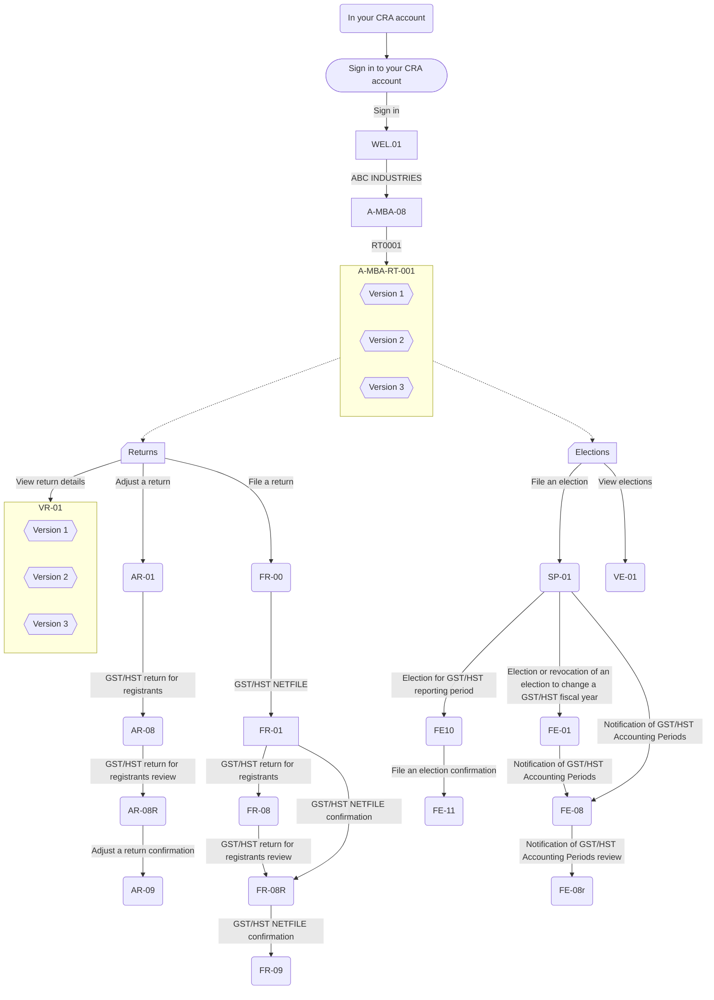

# CRA portal

Project site for CRA portal tests. 

## Important links

- [Sign in to your CRA Account](/cra-portal/index.html)
- [Portal login demo](https://psi3b8.axshare.com/wel-01_eng.html)
- [Portal GST login demo](https://psi3b8.axshare.com/wel-01_GST_eng.html)
- [GST for small businesses COP github repository](https://github.com/cra-design/gst-hst-business/)
- [T1 COP github repository](https://github.com/cra-design/T1-cop/)
- [github.dev](https://github.dev/cra-design/cra-portal/blob/main/)

## MYBA Portal GST Interaction path

## MYBA links

adjust-return

- [/cra-portal/crrnt/gst-hst/adjust-return/b-rt-ar-01_eng.html](/cra-portal/crrnt/gst-hst/adjust-return/b-rt-ar-01_eng.html)
- [/cra-portal/crrnt/gst-hst/adjust-return/b-rt-ar-08_eng.html](/cra-portal/crrnt/gst-hst/adjust-return/b-rt-ar-08_eng.html)
- [/cra-portal/crrnt/gst-hst/adjust-return/b-rt-ar-08r_eng.html](/cra-portal/crrnt/gst-hst/adjust-return/b-rt-ar-08r_eng.html)
- [/cra-portal/crrnt/gst-hst/adjust-return/b-rt-ar-09_eng.html](/cra-portal/crrnt/gst-hst/adjust-return/b-rt-ar-09_eng.html)

calculate-instalment-payments

- [/cra-portal/crrnt/gst-hst/calculate-instalment-payments/b-rt-ipc-01_eng.html](/cra-portal/crrnt/gst-hst/calculate-instalment-payments/b-rt-ipc-01_eng.html)

file-election

- [/cra-portal/crrnt/gst-hst/file-election/b-rt-fe-01_eng.html](/cra-portal/crrnt/gst-hst/file-election/b-rt-fe-01_eng.html)
- [/cra-portal/crrnt/gst-hst/file-election/b-rt-fe-08_eng.html](/cra-portal/crrnt/gst-hst/file-election/b-rt-fe-08_eng.html)
- [/cra-portal/crrnt/gst-hst/file-election/b-rt-fe-08r_eng.html](/cra-portal/crrnt/gst-hst/file-election/b-rt-fe-08r_eng.html)
- [/cra-portal/crrnt/gst-hst/file-election/b-rt-fe-10_eng.html](/cra-portal/crrnt/gst-hst/file-election/b-rt-fe-10_eng.html)
- [/cra-portal/crrnt/gst-hst/file-election/b-rt-fe-11_eng.html](/cra-portal/crrnt/gst-hst/file-election/b-rt-fe-11_eng.html)
- [/cra-portal/crrnt/gst-hst/file-election/b-rt-sp-01_eng.html](/cra-portal/crrnt/gst-hst/file-election/b-rt-sp-01_eng.html)

file-return

- [/cra-portal/crrnt/gst-hst/file-return/b-rt-fr-00_eng.html](/cra-portal/crrnt/gst-hst/file-return/b-rt-fr-00_eng.html)
- [/cra-portal/crrnt/gst-hst/file-return/b-rt-fr-01_eng.html](/cra-portal/crrnt/gst-hst/file-return/b-rt-fr-01_eng.html)
- [/cra-portal/crrnt/gst-hst/file-return/b-rt-fr-08_eng.html](/cra-portal/crrnt/gst-hst/file-return/b-rt-fr-08_eng.html)
- [/cra-portal/crrnt/gst-hst/file-return/b-rt-fr-08r_eng.html](/cra-portal/crrnt/gst-hst/file-return/b-rt-fr-08r_eng.html)
- [/cra-portal/crrnt/gst-hst/file-return/b-rt-fr-09_eng.html](/cra-portal/crrnt/gst-hst/file-return/b-rt-fr-09_eng.html)

view-elections

- [/cra-portal/crrnt/gst-hst/view-elections/b-rt-ve-01_eng.html](/cra-portal/crrnt/gst-hst/view-elections/b-rt-ve-01_eng.html)

view-expected-filed-returns

- [/cra-portal/crrnt/gst-hst/view-expected-filed-returns/b-rt-vr-01_eng.html](/cra-portal/crrnt/gst-hst/view-expected-filed-returns/b-rt-vr-01_eng.html)
   - [/cra-portal/crrnt/gst-hst/view-expected-filed-returns/b-rt-vr-02_eng.html](/cra-portal/crrnt/gst-hst/view-expected-filed-returns/b-rt-vr-02_eng.html)
   - [/cra-portal/crrnt/gst-hst/view-expected-filed-returns/b-rt-vr-02-02_eng.html](/cra-portal/crrnt/gst-hst/view-expected-filed-returns/b-rt-vr-02-02_eng.html)
   - [/cra-portal/crrnt/gst-hst/view-expected-filed-returns/b-rt-vr-02-03_eng.html](/cra-portal/crrnt/gst-hst/view-expected-filed-returns/b-rt-vr-02-03_eng.html)
   - [/cra-portal/crrnt/gst-hst/view-expected-filed-returns/b-rt-vr-02-04_eng.html](/cra-portal/crrnt/gst-hst/view-expected-filed-returns/b-rt-vr-02-04_eng.html)
   - [/cra-portal/crrnt/gst-hst/view-expected-filed-returns/b-rt-vr-02-05_eng.html](/cra-portal/crrnt/gst-hst/view-expected-filed-returns/b-rt-vr-02-05_eng.html)
- [/cra-portal/crrnt/gst-hst/view-expected-filed-returns/b-rt-vr-01-02_eng.html](/cra-portal/crrnt/gst-hst/view-expected-filed-returns/b-rt-vr-01-02_eng.html)
   - [/cra-portal/crrnt/gst-hst/view-expected-filed-returns/b-rt-vr-02-06_eng.html](/cra-portal/crrnt/gst-hst/view-expected-filed-returns/b-rt-vr-02-06_eng.html)
- [/cra-portal/crrnt/gst-hst/view-expected-filed-returns/b-rt-vr-01-03_eng.html](/cra-portal/crrnt/gst-hst/view-expected-filed-returns/b-rt-vr-01-03_eng.html)
   - [/cra-portal/crrnt/gst-hst/view-expected-filed-returns/b-rt-vr-02b_eng.html](/cra-portal/crrnt/gst-hst/view-expected-filed-returns/b-rt-vr-02b_eng.html)

Help files

- [/cra-portal/help/about-enquiries-service.html](/cra-portal/help/about-enquiries-service.html)
- [/cra-portal/help/about-your-profile.html](/cra-portal/help/about-your-profile.html)
- [/cra-portal/help/adjust-a-return.html](/cra-portal/help/adjust-a-return.html)
- [/cra-portal/help/answers-common-questions-goods-services-tax-harmonized-sales-tax-accounts.html](/cra-portal/help/answers-common-questions-goods-services-tax-harmonized-sales-tax-accounts.html)
- [/cra-portal/help/electronic-rebate-forms.html](/cra-portal/help/electronic-rebate-forms.html)
- [/cra-portal/help/file-a-return.html](/cra-portal/help/file-a-return.html)
- [/cra-portal/help/file-election.html](/cra-portal/help/file-election.html)
- [/cra-portal/help/gst-hst-electronic-filing.html](/cra-portal/help/gst-hst-electronic-filing.html)
- [/cra-portal/help/help-business-account.html](/cra-portal/help/help-business-account.html)
- [/cra-portal/help/help-enquiries-service.html](/cra-portal/help/help-enquiries-service.html)
- [/cra-portal/help/payments-cra.html](/cra-portal/help/payments-cra.html)
- [/cra-portal/help/view-expected-filed-returns.html](/cra-portal/help/view-expected-filed-returns.html)

